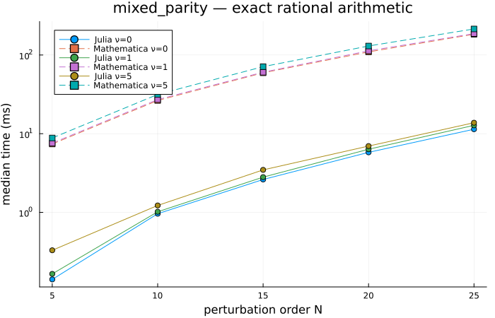
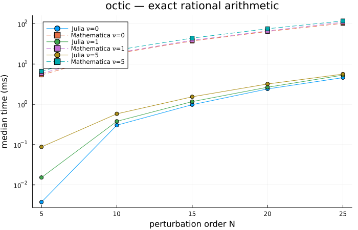
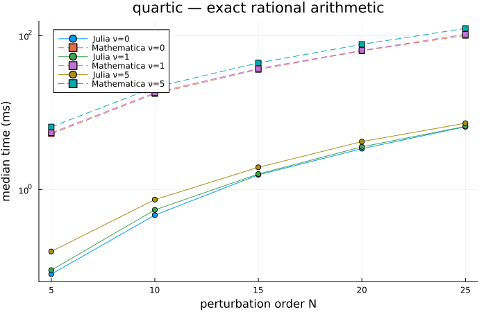
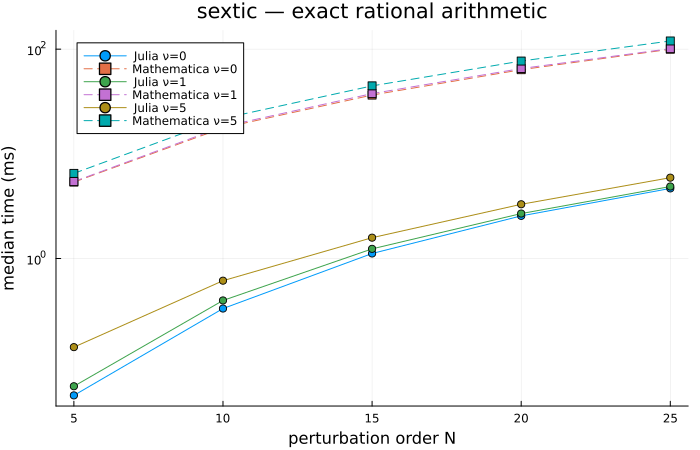

# BenderWu — Julia vs Mathematica benchmarks

Comparison of this Julia package against the reference Mathematica
implementation `BenderWu.m` (arXiv:1608.08256). Both
implementations compute the perturbative energy corrections ε_l for
l = 0…N at fixed quantum number ν using the polynomial potentials
shown below.

Only **exact-rational arithmetic** is benchmarked. A Float64 vs
MachinePrecision comparison would not be apples-to-apples:
Mathematica's `BenderWu` evaluates the recursion through its
symbolic term-rewriting pipeline regardless of coefficient
precision, so the gap there mostly measures evaluator overhead
rather than algorithmic efficiency. In exact-rational mode both
sides do genuine big-integer arithmetic and the comparison is
meaningful.

## Setup

| | |
|---|---|
| Julia      | 1.12.6 |
| Mathematica| 14.3.0 for Mac OS X ARM (64-bit) (July 8, 2025) |
| CPU        | Apple M1 Pro (8 threads) |
| OS         | Darwin / aarch64 |

Julia timings come from `BenchmarkTools.@benchmark` (median over
many samples, with a fresh `Potential` per sample so caches are
cold). Mathematica timings come from `RepeatedTiming` which
averages an automatically chosen number of repetitions.

## Validation

Both implementations were checked to agree on ε_l (even orders)
before timings were recorded — bit-for-bit equality on rationals.

**60/60** cases match exactly.

## Results

| potential | ν | N | Julia | Mathematica | speedup |
|---|---|---|---:|---:|---:|
| mixed_parity | 0 | 5 | 0.141 ms | 7.40 ms | 52.6× |
| mixed_parity | 0 | 10 | 0.961 ms | 26.43 ms | 27.5× |
| mixed_parity | 0 | 15 | 2.62 ms | 59.43 ms | 22.7× |
| mixed_parity | 0 | 20 | 5.79 ms | 109.5 ms | 18.9× |
| mixed_parity | 0 | 25 | 11.40 ms | 183.6 ms | 16.1× |
| mixed_parity | 1 | 5 | 0.165 ms | 7.59 ms | 46.0× |
| mixed_parity | 1 | 10 | 1.02 ms | 27.15 ms | 26.7× |
| mixed_parity | 1 | 15 | 2.80 ms | 60.46 ms | 21.6× |
| mixed_parity | 1 | 20 | 6.34 ms | 113.0 ms | 17.8× |
| mixed_parity | 1 | 25 | 12.77 ms | 187.1 ms | 14.6× |
| mixed_parity | 5 | 5 | 0.330 ms | 8.82 ms | 26.8× |
| mixed_parity | 5 | 10 | 1.22 ms | 31.54 ms | 25.8× |
| mixed_parity | 5 | 15 | 3.47 ms | 71.09 ms | 20.5× |
| mixed_parity | 5 | 20 | 6.96 ms | 130.2 ms | 18.7× |
| mixed_parity | 5 | 25 | 13.79 ms | 214.4 ms | 15.5× |
| octic | 0 | 5 | 0.0037 ms | 5.36 ms | 1435× |
| octic | 0 | 10 | 0.303 ms | 18.31 ms | 60.4× |
| octic | 0 | 15 | 0.980 ms | 37.34 ms | 38.1× |
| octic | 0 | 20 | 2.41 ms | 64.27 ms | 26.7× |
| octic | 0 | 25 | 4.60 ms | 102.4 ms | 22.3× |
| octic | 1 | 5 | 0.015 ms | 5.84 ms | 383× |
| octic | 1 | 10 | 0.379 ms | 19.06 ms | 50.4× |
| octic | 1 | 15 | 1.17 ms | 38.77 ms | 33.2× |
| octic | 1 | 20 | 2.66 ms | 66.37 ms | 25.0× |
| octic | 1 | 25 | 5.31 ms | 109.4 ms | 20.6× |
| octic | 5 | 5 | 0.088 ms | 6.62 ms | 75.6× |
| octic | 5 | 10 | 0.581 ms | 22.21 ms | 38.3× |
| octic | 5 | 15 | 1.54 ms | 44.04 ms | 28.7× |
| octic | 5 | 20 | 3.20 ms | 75.17 ms | 23.5× |
| octic | 5 | 25 | 5.63 ms | 117.5 ms | 20.9× |
| quartic | 0 | 5 | 0.080 ms | 5.28 ms | 66.4× |
| quartic | 0 | 10 | 0.465 ms | 17.58 ms | 37.8× |
| quartic | 0 | 15 | 1.55 ms | 36.26 ms | 23.3× |
| quartic | 0 | 20 | 3.39 ms | 63.33 ms | 18.7× |
| quartic | 0 | 25 | 6.54 ms | 100.3 ms | 15.3× |
| quartic | 1 | 5 | 0.090 ms | 5.46 ms | 60.8× |
| quartic | 1 | 10 | 0.544 ms | 18.10 ms | 33.3× |
| quartic | 1 | 15 | 1.59 ms | 37.27 ms | 23.4× |
| quartic | 1 | 20 | 3.59 ms | 64.21 ms | 17.9× |
| quartic | 1 | 25 | 6.61 ms | 103.9 ms | 15.7× |
| quartic | 5 | 5 | 0.157 ms | 6.51 ms | 41.5× |
| quartic | 5 | 10 | 0.740 ms | 21.40 ms | 28.9× |
| quartic | 5 | 15 | 1.94 ms | 44.16 ms | 22.7× |
| quartic | 5 | 20 | 4.20 ms | 76.93 ms | 18.3× |
| quartic | 5 | 25 | 7.27 ms | 124.0 ms | 17.1× |
| sextic | 0 | 5 | 0.049 ms | 5.37 ms | 109× |
| sextic | 0 | 10 | 0.333 ms | 17.72 ms | 53.2× |
| sextic | 0 | 15 | 1.12 ms | 36.43 ms | 32.6× |
| sextic | 0 | 20 | 2.56 ms | 63.63 ms | 24.9× |
| sextic | 0 | 25 | 4.67 ms | 99.78 ms | 21.3× |
| sextic | 1 | 5 | 0.060 ms | 5.43 ms | 90.1× |
| sextic | 1 | 10 | 0.398 ms | 18.19 ms | 45.7× |
| sextic | 1 | 15 | 1.24 ms | 37.62 ms | 30.4× |
| sextic | 1 | 20 | 2.69 ms | 65.26 ms | 24.3× |
| sextic | 1 | 25 | 4.87 ms | 101.1 ms | 20.7× |
| sextic | 5 | 5 | 0.142 ms | 6.50 ms | 45.7× |
| sextic | 5 | 10 | 0.614 ms | 21.77 ms | 35.4× |
| sextic | 5 | 15 | 1.58 ms | 44.57 ms | 28.2× |
| sextic | 5 | 20 | 3.30 ms | 76.95 ms | 23.3× |
| sextic | 5 | 25 | 5.92 ms | 119.7 ms | 20.2× |

### Per-potential timings

### Speedup factor

Per-cell ratio of Mathematica median time to Julia median time
(at ν = 0). Higher is better for Julia.

## Reproducing

See [benchmark/README.md](benchmark/README.md) for the exact
commands to regenerate this report.
