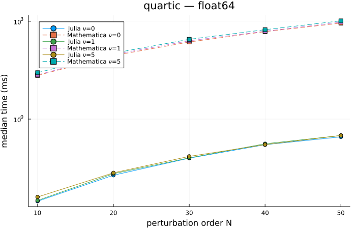
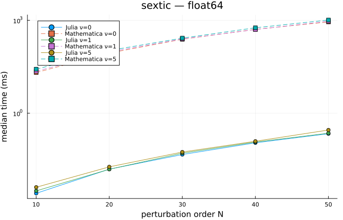
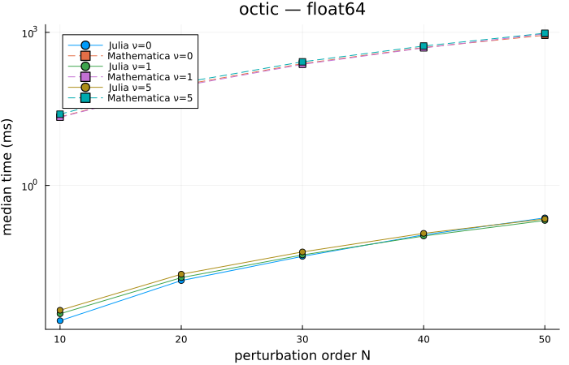
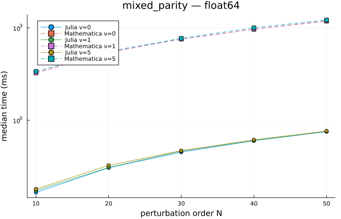
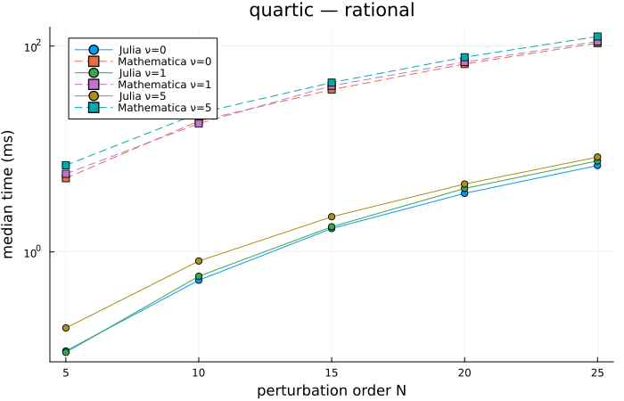
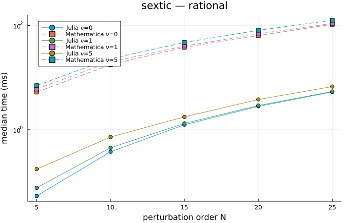
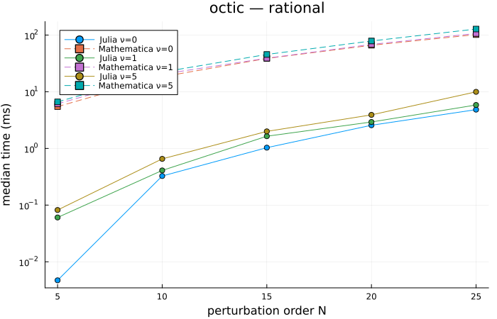
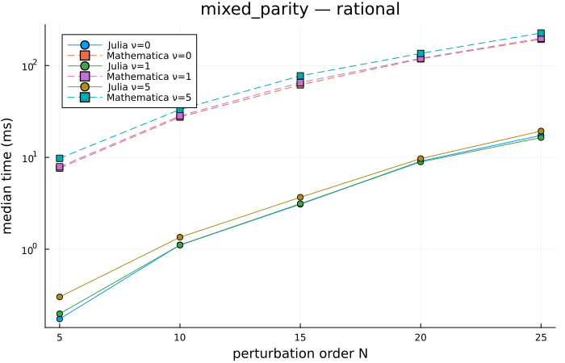
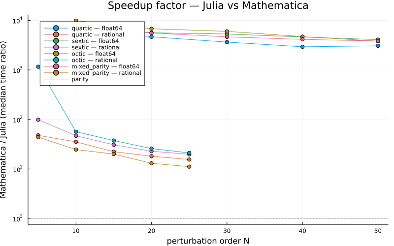

# BenderWu — Julia vs Mathematica benchmarks

Comparison of this Julia package against the reference Mathematica
implementation `BenderWu.m` (Sulejmanpasic, arXiv:1608.08256).
Both implementations compute perturbative energy corrections
ε_l up to a maximum order N at fixed quantum number ν using the
polynomial potentials shown below.

## Setup

| | |
|---|---|
| Julia      | 1.12.6 |
| Mathematica| 14.3.0 for Mac OS X ARM (64-bit) (July 8, 2025) |
| CPU        | Apple M1 Pro (8 threads) |
| OS         | Darwin / aarch64 |

Julia timings come from `BenchmarkTools.@benchmark` (median over
many samples, with a fresh `Potential` per sample so caches are
cold). Mathematica timings come from `RepeatedTiming` which
averages an automatically chosen number of repetitions.

## Validation

Both implementations were checked to agree on ε_l (even orders)
before timings were recorded.

- **120/120** cases match within tolerance.
- Tolerance for `float64`/`MachinePrecision`: relative error
  `≤ 10⁻¹⁰ · 10^(l/4)` capped at `10⁻¹`. The cap reflects the
  expected drift between two IEEE-double implementations whose
  summation orders differ — high-order ε_l can lose several
  digits of precision in either code.
- Tolerance for `rational`/exact: bit-for-bit equality.

## Float64 vs MachinePrecision

| potential | ν | N | Julia | Mathematica | speedup | match |
|---|---|---|---:|---:|---:|:---:|
| mixed_parity | 0 | 10 | 0.0046 ms | 34.97 ms | 7661× | ✓ |
| mixed_parity | 0 | 20 | 0.029 ms | 160.0 ms | 5566× | ✓ |
| mixed_parity | 0 | 30 | 0.093 ms | 430.6 ms | 4642× | ✓ |
| mixed_parity | 0 | 40 | 0.217 ms | 896.9 ms | 4131× | ✓ |
| mixed_parity | 0 | 50 | 0.428 ms | 1638.5 ms | 3830× | ✓ |
| mixed_parity | 1 | 10 | 0.0052 ms | 34.04 ms | 6536× | ✓ |
| mixed_parity | 1 | 20 | 0.030 ms | 161.9 ms | 5456× | ✓ |
| mixed_parity | 1 | 30 | 0.100 ms | 430.6 ms | 4316× | ✓ |
| mixed_parity | 1 | 40 | 0.222 ms | 908.0 ms | 4091× | ✓ |
| mixed_parity | 1 | 50 | 0.437 ms | 1689.2 ms | 3861× | ✓ |
| mixed_parity | 5 | 10 | 0.0059 ms | 38.53 ms | 6555× | ✓ |
| mixed_parity | 5 | 20 | 0.034 ms | 171.3 ms | 4974× | ✓ |
| mixed_parity | 5 | 30 | 0.103 ms | 457.0 ms | 4415× | ✓ |
| mixed_parity | 5 | 40 | 0.232 ms | 1006.7 ms | 4337× | ✓ |
| mixed_parity | 5 | 50 | 0.449 ms | 1800.9 ms | 4015× | ✓ |
| octic | 0 | 10 | 0.0022 ms | 22.01 ms | 9876× | ✓ |
| octic | 0 | 20 | 0.014 ms | 92.39 ms | 6771× | ✓ |
| octic | 0 | 30 | 0.041 ms | 244.2 ms | 6001× | ✓ |
| octic | 0 | 40 | 0.107 ms | 505.6 ms | 4706× | ✓ |
| octic | 0 | 50 | 0.231 ms | 878.6 ms | 3799× | ✓ |
| octic | 1 | 10 | 0.0031 ms | 21.67 ms | 7104× | ✓ |
| octic | 1 | 20 | 0.016 ms | 88.25 ms | 5663× | ✓ |
| octic | 1 | 30 | 0.043 ms | 236.3 ms | 5442× | ✓ |
| octic | 1 | 40 | 0.102 ms | 496.5 ms | 4867× | ✓ |
| octic | 1 | 50 | 0.206 ms | 934.5 ms | 4543× | ✓ |
| octic | 5 | 10 | 0.0036 ms | 24.93 ms | 6972× | ✓ |
| octic | 5 | 20 | 0.018 ms | 102.4 ms | 5622× | ✓ |
| octic | 5 | 30 | 0.050 ms | 264.9 ms | 5325× | ✓ |
| octic | 5 | 40 | 0.115 ms | 540.0 ms | 4692× | ✓ |
| octic | 5 | 50 | 0.220 ms | 962.5 ms | 4367× | ✓ |
| quartic | 0 | 10 | 0.0030 ms | 21.78 ms | 7183× | ✓ |
| quartic | 0 | 20 | 0.019 ms | 88.49 ms | 4657× | ✓ |
| quartic | 0 | 30 | 0.063 ms | 231.0 ms | 3644× | ✓ |
| quartic | 0 | 40 | 0.164 ms | 480.4 ms | 2932× | ✓ |
| quartic | 0 | 50 | 0.286 ms | 876.2 ms | 3064× | ✓ |
| quartic | 1 | 10 | 0.0032 ms | 22.68 ms | 7098× | ✓ |
| quartic | 1 | 20 | 0.021 ms | 95.09 ms | 4497× | ✓ |
| quartic | 1 | 30 | 0.065 ms | 252.1 ms | 3892× | ✓ |
| quartic | 1 | 40 | 0.175 ms | 493.9 ms | 2821× | ✓ |
| quartic | 1 | 50 | 0.314 ms | 936.9 ms | 2983× | ✓ |
| quartic | 5 | 10 | 0.0041 ms | 26.49 ms | 6474× | ✓ |
| quartic | 5 | 20 | 0.022 ms | 104.6 ms | 4659× | ✓ |
| quartic | 5 | 30 | 0.072 ms | 279.4 ms | 3888× | ✓ |
| quartic | 5 | 40 | 0.165 ms | 551.4 ms | 3350× | ✓ |
| quartic | 5 | 50 | 0.314 ms | 1029.4 ms | 3277× | ✓ |
| sextic | 0 | 10 | 0.0026 ms | 20.51 ms | 7962× | ✓ |
| sextic | 0 | 20 | 0.016 ms | 87.33 ms | 5627× | ✓ |
| sextic | 0 | 30 | 0.046 ms | 244.5 ms | 5300× | ✓ |
| sextic | 0 | 40 | 0.110 ms | 508.9 ms | 4614× | ✓ |
| sextic | 0 | 50 | 0.217 ms | 885.7 ms | 4086× | ✓ |
| sextic | 1 | 10 | 0.0031 ms | 22.48 ms | 7281× | ✓ |
| sextic | 1 | 20 | 0.015 ms | 94.42 ms | 6141× | ✓ |
| sextic | 1 | 30 | 0.051 ms | 249.3 ms | 4886× | ✓ |
| sextic | 1 | 40 | 0.117 ms | 502.4 ms | 4306× | ✓ |
| sextic | 1 | 50 | 0.226 ms | 931.8 ms | 4131× | ✓ |
| sextic | 5 | 10 | 0.0040 ms | 26.35 ms | 6520× | ✓ |
| sextic | 5 | 20 | 0.018 ms | 105.6 ms | 5733× | ✓ |
| sextic | 5 | 30 | 0.055 ms | 265.7 ms | 4790× | ✓ |
| sextic | 5 | 40 | 0.124 ms | 572.5 ms | 4627× | ✓ |
| sextic | 5 | 50 | 0.286 ms | 1020.7 ms | 3572× | ✓ |

## Rational{BigInt} vs Mathematica exact

| potential | ν | N | Julia | Mathematica | speedup | match |
|---|---|---|---:|---:|---:|:---:|
| mixed_parity | 0 | 5 | 0.174 ms | 7.65 ms | 43.9× | ✓ |
| mixed_parity | 0 | 10 | 1.11 ms | 27.47 ms | 24.6× | ✓ |
| mixed_parity | 0 | 15 | 3.09 ms | 61.61 ms | 20.0× | ✓ |
| mixed_parity | 0 | 20 | 9.10 ms | 118.2 ms | 13.0× | ✓ |
| mixed_parity | 0 | 25 | 17.37 ms | 193.1 ms | 11.1× | ✓ |
| mixed_parity | 1 | 5 | 0.199 ms | 7.90 ms | 39.8× | ✓ |
| mixed_parity | 1 | 10 | 1.11 ms | 28.36 ms | 25.5× | ✓ |
| mixed_parity | 1 | 15 | 3.13 ms | 65.21 ms | 20.8× | ✓ |
| mixed_parity | 1 | 20 | 8.93 ms | 119.9 ms | 13.4× | ✓ |
| mixed_parity | 1 | 25 | 16.45 ms | 198.5 ms | 12.1× | ✓ |
| mixed_parity | 5 | 5 | 0.303 ms | 9.77 ms | 32.3× | ✓ |
| mixed_parity | 5 | 10 | 1.35 ms | 33.24 ms | 24.6× | ✓ |
| mixed_parity | 5 | 15 | 3.68 ms | 77.14 ms | 21.0× | ✓ |
| mixed_parity | 5 | 20 | 9.69 ms | 135.5 ms | 14.0× | ✓ |
| mixed_parity | 5 | 25 | 19.35 ms | 225.8 ms | 11.7× | ✓ |
| octic | 0 | 5 | 0.0047 ms | 5.47 ms | 1160× | ✓ |
| octic | 0 | 10 | 0.326 ms | 18.39 ms | 56.4× | ✓ |
| octic | 0 | 15 | 1.03 ms | 38.63 ms | 37.5× | ✓ |
| octic | 0 | 20 | 2.56 ms | 66.05 ms | 25.8× | ✓ |
| octic | 0 | 25 | 4.83 ms | 101.9 ms | 21.1× | ✓ |
| octic | 1 | 5 | 0.061 ms | 6.13 ms | 101× | ✓ |
| octic | 1 | 10 | 0.409 ms | 20.42 ms | 49.9× | ✓ |
| octic | 1 | 15 | 1.64 ms | 39.05 ms | 23.8× | ✓ |
| octic | 1 | 20 | 2.93 ms | 68.33 ms | 23.3× | ✓ |
| octic | 1 | 25 | 5.84 ms | 106.6 ms | 18.3× | ✓ |
| octic | 5 | 5 | 0.082 ms | 6.63 ms | 80.9× | ✓ |
| octic | 5 | 10 | 0.654 ms | 22.22 ms | 34.0× | ✓ |
| octic | 5 | 15 | 2.00 ms | 45.49 ms | 22.8× | ✓ |
| octic | 5 | 20 | 3.91 ms | 78.64 ms | 20.1× | ✓ |
| octic | 5 | 25 | 9.96 ms | 127.7 ms | 12.8× | ✓ |
| quartic | 0 | 5 | 0.109 ms | 5.20 ms | 47.6× | ✓ |
| quartic | 0 | 10 | 0.531 ms | 18.70 ms | 35.2× | ✓ |
| quartic | 0 | 15 | 1.69 ms | 37.72 ms | 22.3× | ✓ |
| quartic | 0 | 20 | 3.71 ms | 66.96 ms | 18.1× | ✓ |
| quartic | 0 | 25 | 6.91 ms | 107.0 ms | 15.5× | ✓ |
| quartic | 1 | 5 | 0.106 ms | 5.74 ms | 54.3× | ✓ |
| quartic | 1 | 10 | 0.580 ms | 17.66 ms | 30.4× | ✓ |
| quartic | 1 | 15 | 1.76 ms | 41.19 ms | 23.5× | ✓ |
| quartic | 1 | 20 | 4.14 ms | 69.99 ms | 16.9× | ✓ |
| quartic | 1 | 25 | 7.66 ms | 111.2 ms | 14.5× | ✓ |
| quartic | 5 | 5 | 0.183 ms | 6.95 ms | 38.1× | ✓ |
| quartic | 5 | 10 | 0.816 ms | 22.29 ms | 27.3× | ✓ |
| quartic | 5 | 15 | 2.20 ms | 44.18 ms | 20.1× | ✓ |
| quartic | 5 | 20 | 4.57 ms | 78.02 ms | 17.1× | ✓ |
| quartic | 5 | 25 | 8.36 ms | 123.9 ms | 14.8× | ✓ |
| sextic | 0 | 5 | 0.054 ms | 5.28 ms | 98.5× | ✓ |
| sextic | 0 | 10 | 0.379 ms | 17.71 ms | 46.8× | ✓ |
| sextic | 0 | 15 | 1.24 ms | 38.31 ms | 30.8× | ✓ |
| sextic | 0 | 20 | 2.82 ms | 64.15 ms | 22.8× | ✓ |
| sextic | 0 | 25 | 5.33 ms | 105.1 ms | 19.7× | ✓ |
| sextic | 1 | 5 | 0.077 ms | 6.02 ms | 78.7× | ✓ |
| sextic | 1 | 10 | 0.452 ms | 20.09 ms | 44.5× | ✓ |
| sextic | 1 | 15 | 1.32 ms | 40.46 ms | 30.7× | ✓ |
| sextic | 1 | 20 | 2.92 ms | 69.31 ms | 23.7× | ✓ |
| sextic | 1 | 25 | 5.43 ms | 110.0 ms | 20.3× | ✓ |
| sextic | 5 | 5 | 0.176 ms | 7.03 ms | 40.1× | ✓ |
| sextic | 5 | 10 | 0.724 ms | 23.11 ms | 31.9× | ✓ |
| sextic | 5 | 15 | 1.77 ms | 47.37 ms | 26.8× | ✓ |
| sextic | 5 | 20 | 3.82 ms | 81.05 ms | 21.2× | ✓ |
| sextic | 5 | 25 | 6.75 ms | 126.0 ms | 18.7× | ✓ |

## Overall speedup

Per-cell ratio of Mathematica median time to Julia median time
(at ν = 0). Higher is better for Julia.

## Reproducing

See [benchmark/README.md](benchmark/README.md) for the exact
commands to regenerate this report.
