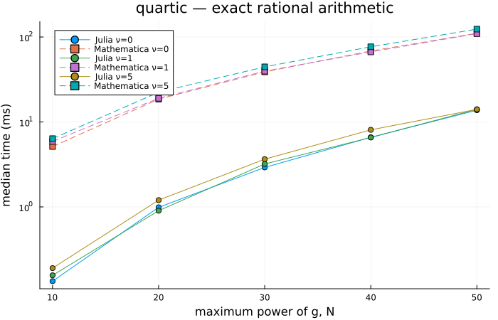
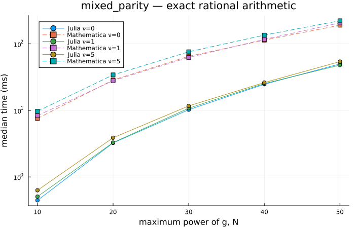
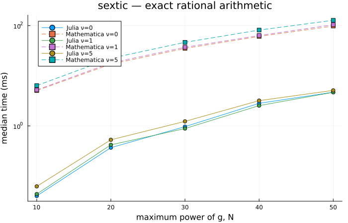
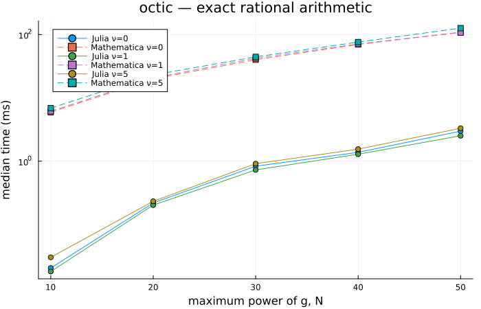
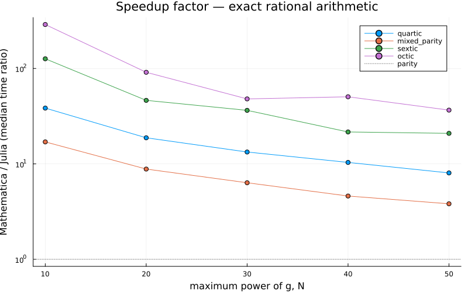

# BenderWu — Julia vs Mathematica benchmarks

Comparison of this Julia package against the reference Mathematica
implementation `BenderWu.m` ([arXiv:1608.08256](https://arxiv.org/abs/1608.08256)). Both
implementations compute the perturbative energy corrections ε_l of
E = Σ ε_l g^l at fixed quantum number ν for the polynomial potentials
shown below. N is the highest power of g: Julia computes l = 0…N, and
Mathematica is called as `BenderWu[V, x, ν, N/2]`, since its order
argument counts powers of g².

Only **exact-rational arithmetic** is benchmarked.
Mathematica's `BenderWu` evaluates the recursion through its
symbolic term-rewriting pipeline regardless of coefficient
precision, so the gap there mostly measures evaluator overhead
rather than algorithmic efficiency. In exact-rational mode both
sides do genuine big-integer arithmetic and the comparison is
meaningful.

## Setup

| | |
|---|---|
| Julia      | 1.13.1 |
| Mathematica| 15.0.0 for Mac OS X ARM (64-bit) (May 19, 2026) |
| CPU        | Apple M1 Pro (10 threads) |
| OS         | Darwin / aarch64 |

Both sides report the median over up to 50 samples within a 5 s
budget per case, after a warm-up call. Julia uses
`BenchmarkTools.@benchmark` with a fresh `Potential` per sample so
caches are cold; Mathematica uses `AbsoluteTiming` in a loop with
the same limits.

## Validation

For every case, Julia's ε vector has N + 1 entries with all odd
orders zero, Mathematica's has N/2 + 1 entries, and after dropping
Julia's odd orders the two vectors are identical — bit-for-bit
equality on rationals. Both sides ran the same set of cases.

**60/60** cases match exactly.

## Potentials

| name | V(x) |
|---|---|
| quartic | x²/2 + x⁴ |
| mixed_parity | x²/2 + x³ + x⁴ |
| sextic | x²/2 + x⁶ |
| octic | x²/2 + x⁸ |

## Results

### Per-potential timings

### Speedup factor

Per-cell ratio of Mathematica median time to Julia median time
(at ν = 0). Higher is better for Julia.

### Timing table

| potential | ν | N | Julia | Mathematica | speedup |
|---|---|---|---:|---:|---:|
| quartic | 0 | 10 | 0.134 ms | 5.14 ms | 38.4× |
| quartic | 0 | 20 | 0.989 ms | 18.57 ms | 18.8× |
| quartic | 0 | 30 | 2.92 ms | 38.84 ms | 13.3× |
| quartic | 0 | 40 | 6.60 ms | 68.40 ms | 10.4× |
| quartic | 0 | 50 | 13.75 ms | 110.5 ms | 8.0× |
| quartic | 1 | 10 | 0.157 ms | 5.89 ms | 37.6× |
| quartic | 1 | 20 | 0.902 ms | 19.01 ms | 21.1× |
| quartic | 1 | 30 | 3.20 ms | 39.64 ms | 12.4× |
| quartic | 1 | 40 | 6.56 ms | 66.72 ms | 10.2× |
| quartic | 1 | 50 | 14.09 ms | 109.5 ms | 7.8× |
| quartic | 5 | 10 | 0.190 ms | 6.36 ms | 33.4× |
| quartic | 5 | 20 | 1.20 ms | 22.38 ms | 18.6× |
| quartic | 5 | 30 | 3.65 ms | 44.53 ms | 12.2× |
| quartic | 5 | 40 | 8.08 ms | 76.72 ms | 9.5× |
| quartic | 5 | 50 | 14.07 ms | 123.8 ms | 8.8× |
| mixed_parity | 0 | 10 | 0.445 ms | 7.57 ms | 17.0× |
| mixed_parity | 0 | 20 | 3.25 ms | 28.66 ms | 8.8× |
| mixed_parity | 0 | 30 | 10.25 ms | 65.03 ms | 6.3× |
| mixed_parity | 0 | 40 | 24.74 ms | 113.9 ms | 4.6× |
| mixed_parity | 0 | 50 | 49.95 ms | 190.7 ms | 3.8× |
| mixed_parity | 1 | 10 | 0.507 ms | 8.36 ms | 16.5× |
| mixed_parity | 1 | 20 | 3.29 ms | 27.97 ms | 8.5× |
| mixed_parity | 1 | 30 | 10.80 ms | 62.52 ms | 5.8× |
| mixed_parity | 1 | 40 | 25.37 ms | 116.8 ms | 4.6× |
| mixed_parity | 1 | 50 | 47.98 ms | 206.9 ms | 4.3× |
| mixed_parity | 5 | 10 | 0.630 ms | 9.72 ms | 15.4× |
| mixed_parity | 5 | 20 | 3.89 ms | 34.20 ms | 8.8× |
| mixed_parity | 5 | 30 | 11.68 ms | 76.06 ms | 6.5× |
| mixed_parity | 5 | 40 | 26.22 ms | 135.4 ms | 5.2× |
| mixed_parity | 5 | 50 | 54.22 ms | 222.5 ms | 4.1× |
| sextic | 0 | 10 | 0.040 ms | 5.06 ms | 126× |
| sextic | 0 | 20 | 0.369 ms | 17.07 ms | 46.3× |
| sextic | 0 | 30 | 0.966 ms | 35.15 ms | 36.4× |
| sextic | 0 | 40 | 2.82 ms | 60.92 ms | 21.6× |
| sextic | 0 | 50 | 4.70 ms | 98.20 ms | 20.9× |
| sextic | 1 | 10 | 0.044 ms | 5.22 ms | 119× |
| sextic | 1 | 20 | 0.419 ms | 18.01 ms | 43.0× |
| sextic | 1 | 30 | 0.885 ms | 37.04 ms | 41.8× |
| sextic | 1 | 40 | 2.54 ms | 63.48 ms | 25.0× |
| sextic | 1 | 50 | 4.68 ms | 104.5 ms | 22.4× |
| sextic | 5 | 10 | 0.062 ms | 6.36 ms | 102× |
| sextic | 5 | 20 | 0.528 ms | 22.34 ms | 42.3× |
| sextic | 5 | 30 | 1.23 ms | 46.41 ms | 37.7× |
| sextic | 5 | 40 | 3.19 ms | 81.42 ms | 25.5× |
| sextic | 5 | 50 | 5.11 ms | 127.6 ms | 25.0× |
| octic | 0 | 10 | 0.021 ms | 5.93 ms | 289× |
| octic | 0 | 20 | 0.219 ms | 19.97 ms | 91.2× |
| octic | 0 | 30 | 0.834 ms | 40.01 ms | 48.0× |
| octic | 0 | 40 | 1.38 ms | 69.62 ms | 50.5× |
| octic | 0 | 50 | 2.98 ms | 109.1 ms | 36.6× |
| octic | 1 | 10 | 0.018 ms | 6.14 ms | 339× |
| octic | 1 | 20 | 0.202 ms | 20.71 ms | 102× |
| octic | 1 | 30 | 0.729 ms | 42.16 ms | 57.9× |
| octic | 1 | 40 | 1.29 ms | 71.14 ms | 55.2× |
| octic | 1 | 50 | 2.52 ms | 107.3 ms | 42.6× |
| octic | 5 | 10 | 0.030 ms | 6.88 ms | 227× |
| octic | 5 | 20 | 0.233 ms | 23.00 ms | 98.9× |
| octic | 5 | 30 | 0.913 ms | 44.37 ms | 48.6× |
| octic | 5 | 40 | 1.55 ms | 76.00 ms | 49.0× |
| octic | 5 | 50 | 3.31 ms | 126.2 ms | 38.1× |

## Reproducing

See [benchmark/README.md](benchmark/README.md) for the exact
commands to regenerate this report.
